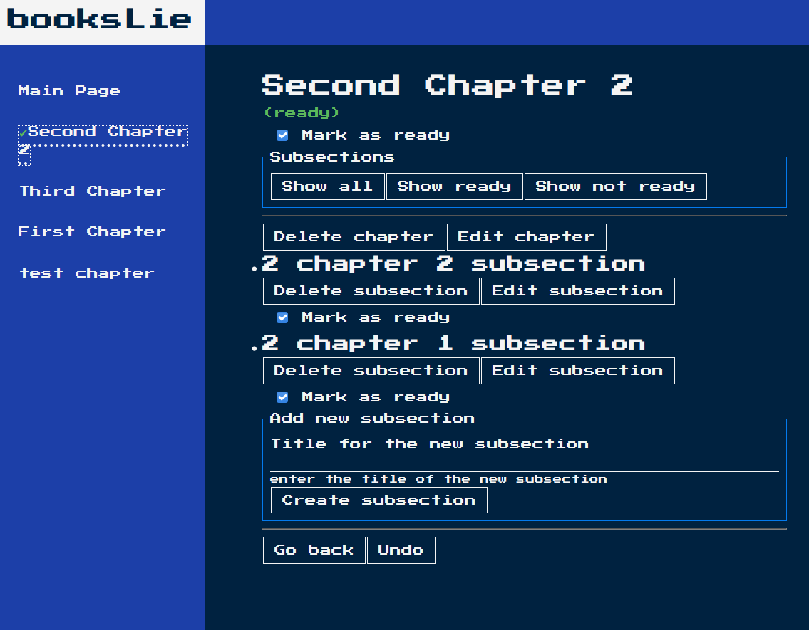

# Create your own book

Simple app to write your own book, with chapters and subsections:

You can write your chapters and subsections - they will be automatically saved at the backend.

You can mark your chapters as ready or, they will be marked as ready automatically as soon as you mark all subsections.

It also has the fature to undo previous actions thanks to redux store and undo library.

Amazing DOS style interface (or just luck of style in me :wink: ) 

Backend:
- restdb.io

Using:
- Redux, 
- Redux-toolkit, 
- react-router, 
- redux-thunk, 
- redux-undo, 
- history etc.

